# YOLO Model Training Summary

This README provides an overview of the training process for YOLO models (n, s, m) at 15 and 50 epochs. The results include confusion matrices, performance metrics, and key evaluation values.

## Training Setup
- Models trained: YOLO n, YOLO s, YOLO m
- Training durations: 15 epochs and 50 epochs
- Evaluation metrics: mAP@50-95, Precision, Recall

## Results for 15 Epochs
### Confusion Matrices

| Model  | YOLO-n | YOLO-s | YOLO-m |
| ------ | ------ | ------ | ------ |
| Confusion Matrix | 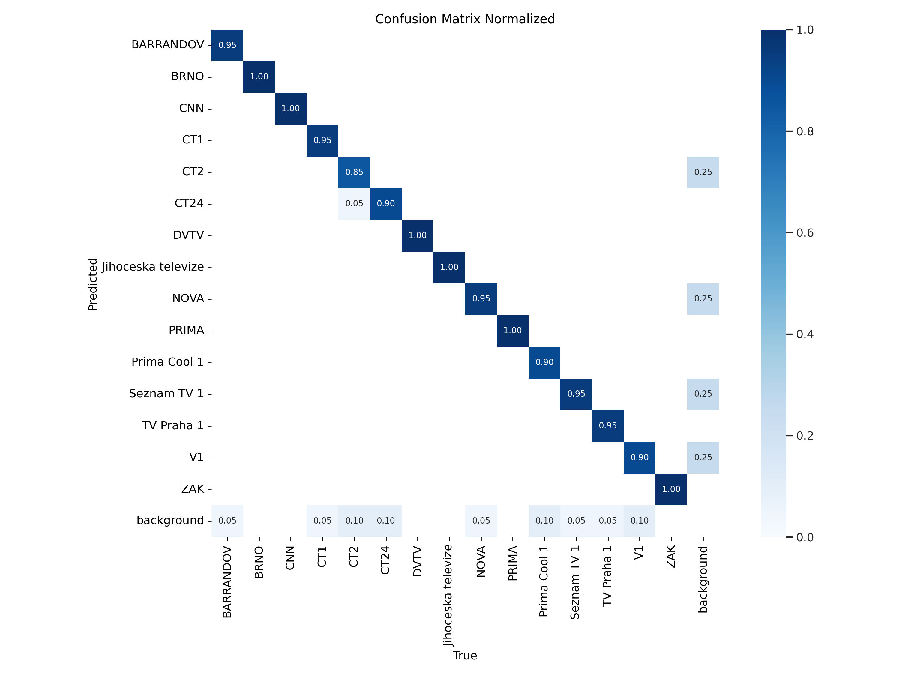 |  | 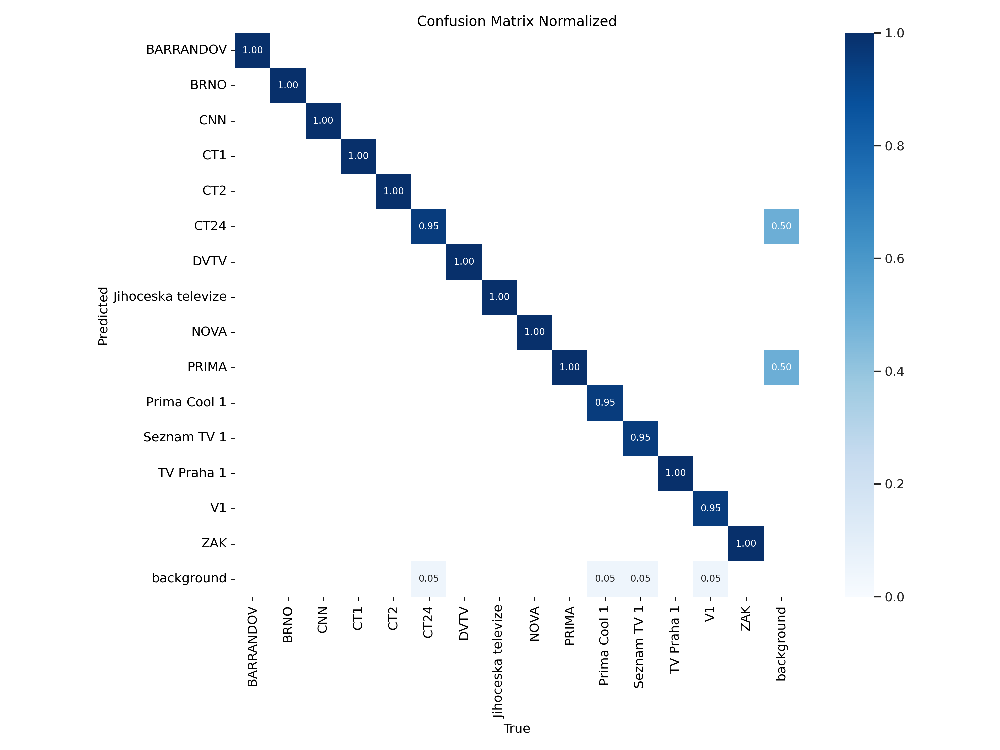 |

### Metrics

| Model | Metrics |
|--------|---------|
| YOLO-n | 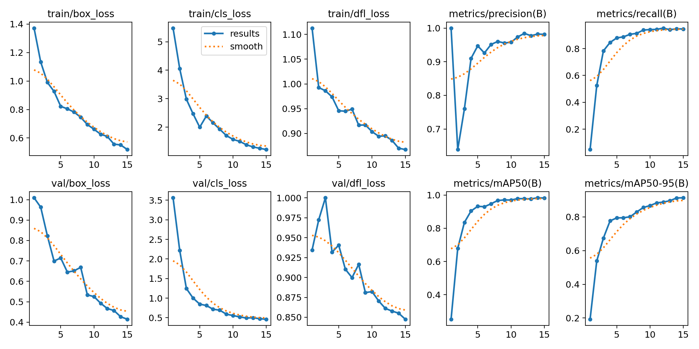 |
| YOLO-s | 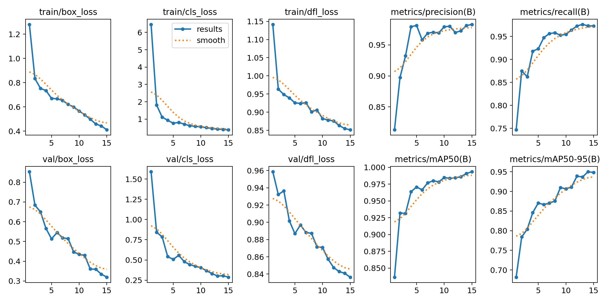 |
| YOLO-m | 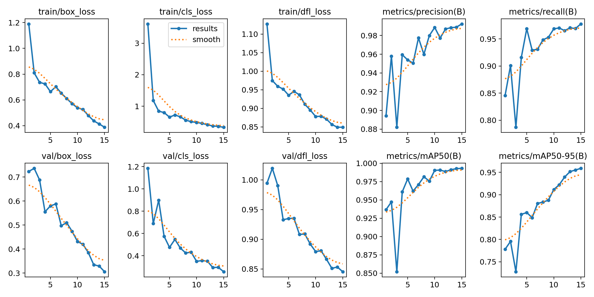 |

### Best mAP@50-95 Scores
| Model  | Best mAP@50-95 |
|--------|--------------|
| YOLO-n | 0.91352      |
| YOLO-s | 0.95014      |
| YOLO-m | *0.95903*      |

### Precision, Recall, mAP@50-95
| Model  | Precision | Recall | mAP@50-95 |
|--------|-----------|--------|-----------|
| YOLO-n | 0.98111   | 0.94554 | 0.91352   |
| YOLO-s | 0.98300   | 0.97264 | 0.94812   |
| YOLO-m | 0.99241   | 0.97767 | *0.95903*   |

---

## Results for 50 Epochs
### Confusion Matrices

| Model  | YOLO-n | YOLO-s | YOLO-m |
| ------ | ------ | ------ | ------ |
| Confusion Matrix | 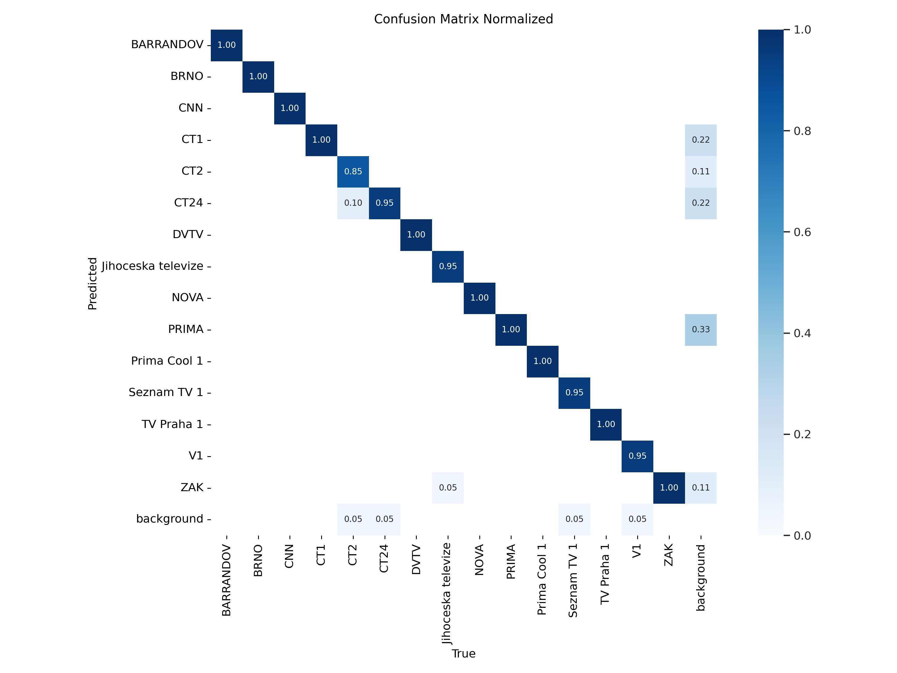 |  | 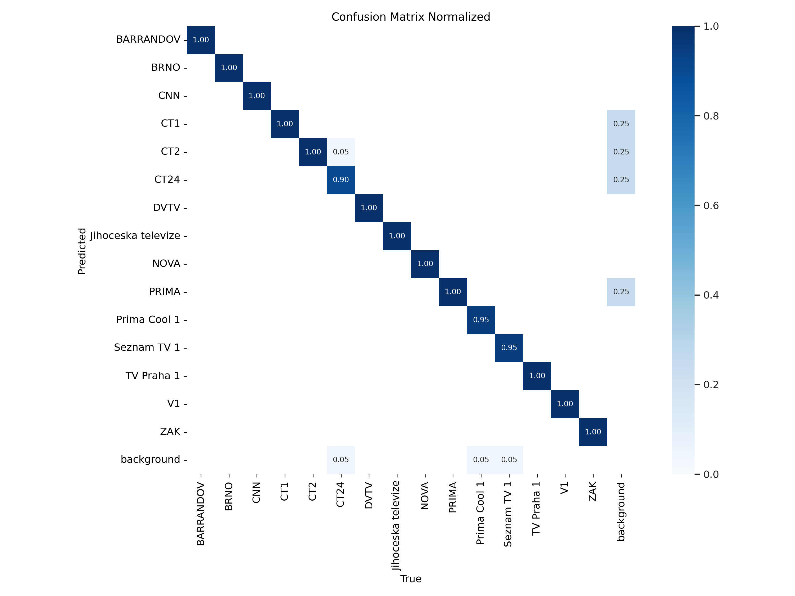 |

### Metrics

| Model | Metrics |
|--------|---------|
| YOLO-n | 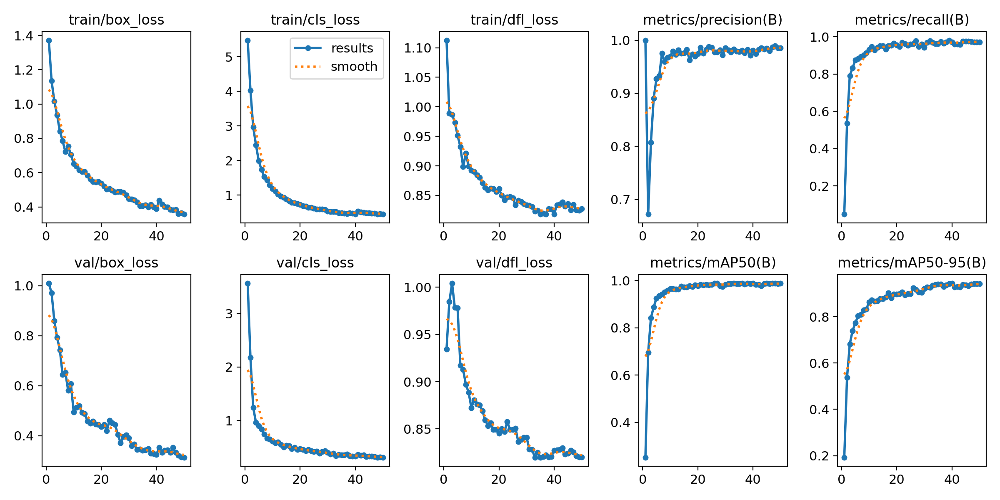 |
| YOLO-s | 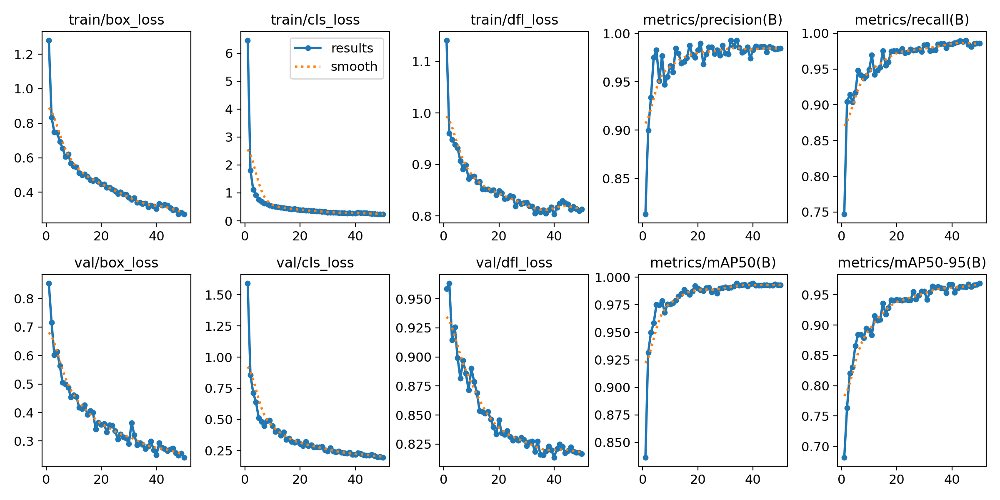 |
| YOLO-m | 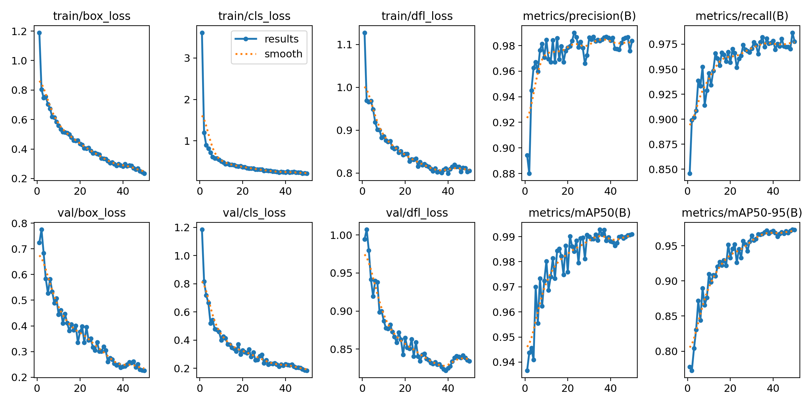 |

### Best mAP@50-95 Scores
| Model  | Best mAP@50-95 |
|--------|--------------|
| YOLO-n | 0.94436      |
| YOLO-s | 0.96885      |
| YOLO-m | **0.97306**      |

### Precision, Recall, mAP@50-95
| Model  | Precision | Recall | mAP@50-95 |
|--------|-----------|--------|-----------|
| YOLO-n | 0.98574   | 0.97265 | 0.94291   |
| YOLO-s | 0.98434   | 0.98580 | 0.96885   |
| YOLO-m | 0.98361   | 0.97773 | **0.97250**   |

---

## Additional Information
- **Augmentation:**
  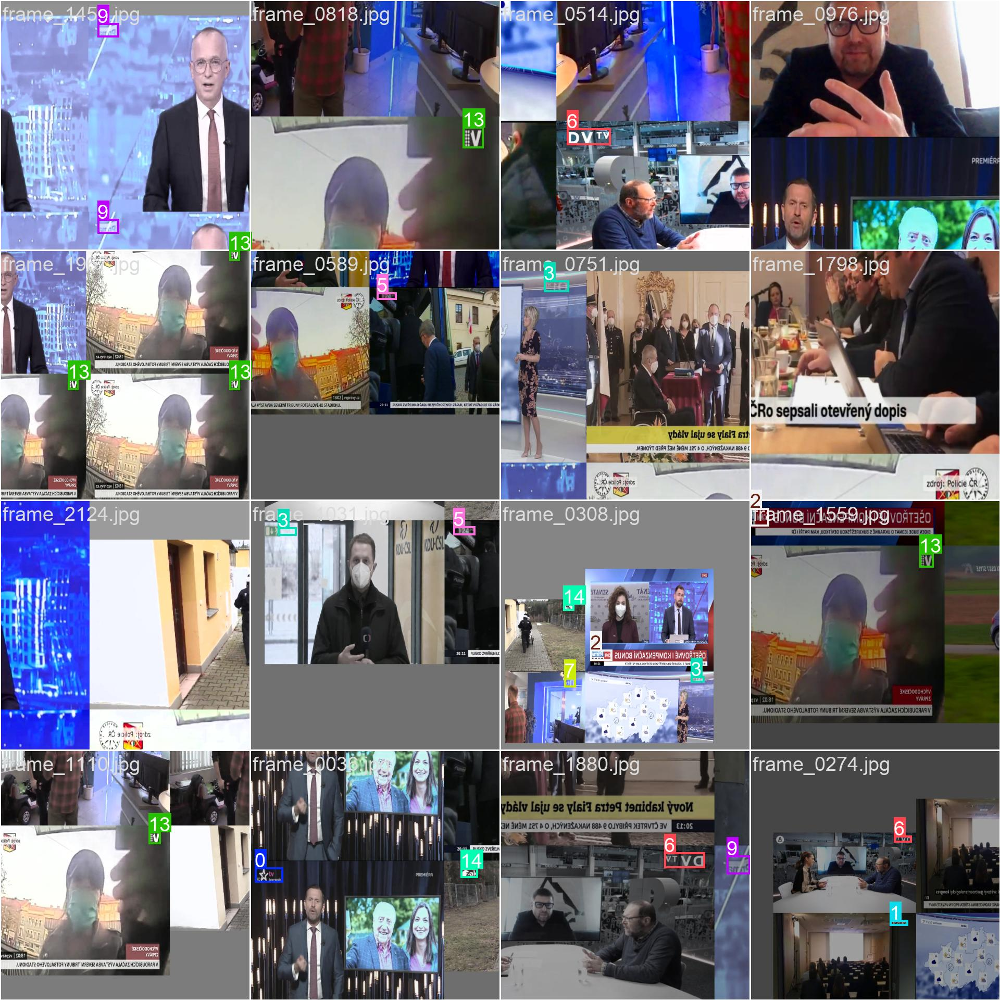
- **Prediction:**
  

